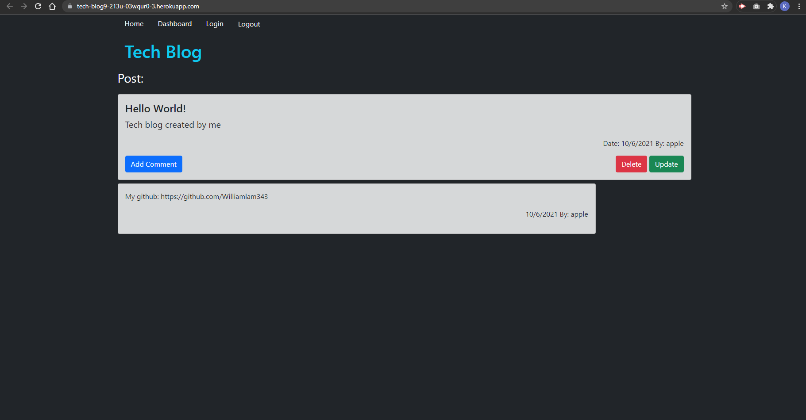

# tech-blog

https://tech-blog9-213u-03wqur0-3.herokuapp.com/

A tech blog that I designed using bootstrap. With a fully functioning frontend and backend. It allows user to create an account, store into a sql database, and authenticate the user to create, delete, and update posts. To test the application remember to npm i all dependencies and create an .env file in order to access the schema database. A few seeds were added for test users, which can be installed using npm run seeds.
 

